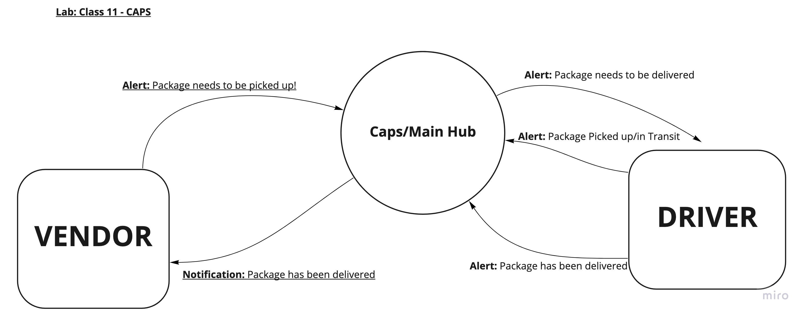
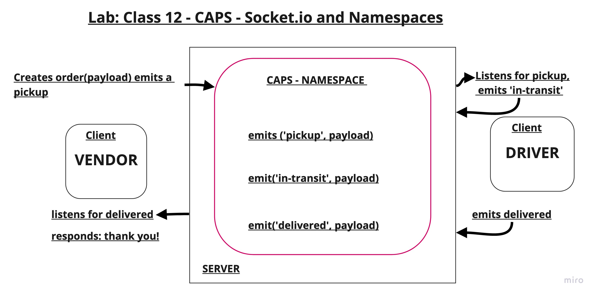
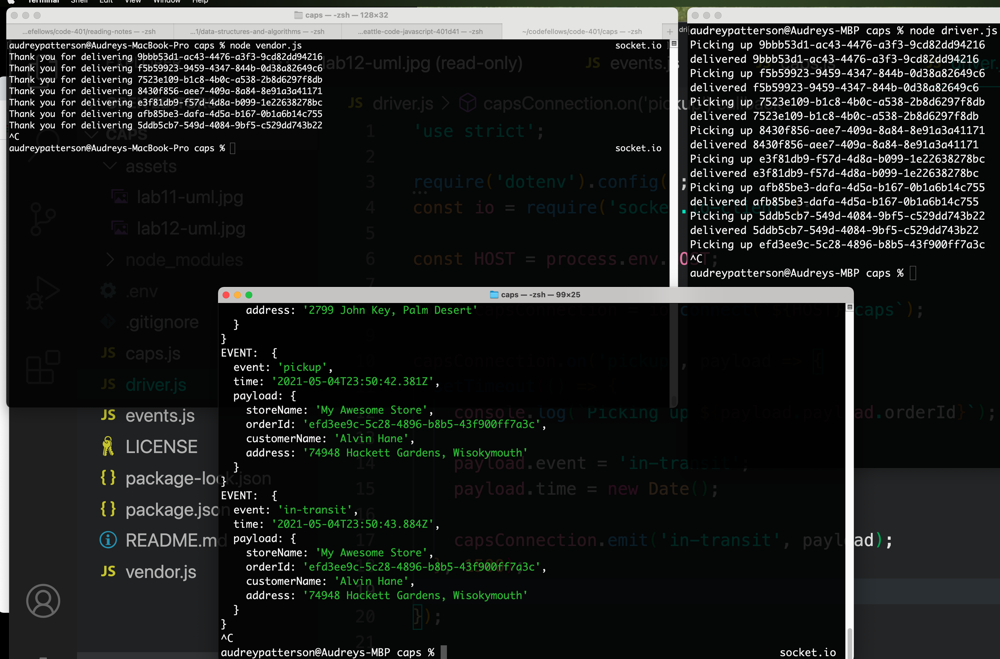

# Lab: Class 13

## Project: CAPS (Code Academy Parcel Service)

- A real-time service that allows for vendors, such as flower shops or restaurants, to alert a system of a package needing to be delivered, for drivers to instantly see what’s in their pickup queue, and then to alert the vendors as to the state of the deliveries (in transit, and then delivered).

### Author: Audrey Patterson

## Links and Resources

- [Pull Request Events to main](https://github.com/arpatterson31/caps/pull/1)
- [Pull Request Socket.io to Main](https://github.com/arpatterson31/caps/pull/2)
- [Pull Request Day 3 - Refactor to Main](https://github.com/arpatterson31/caps/pull/3)
- [Pull Request Day 4 - Queue](https://github.com/arpatterson31/caps/pull/4)

- [Socket emit cheatsheet](https://socket.io/docs/v3/emit-cheatsheet/index.html)

### UML / Application Wiring Diagram

- Lab 11 UML

- Lab 12 UML - Socket.io

- Lab 12 Terminal Results

